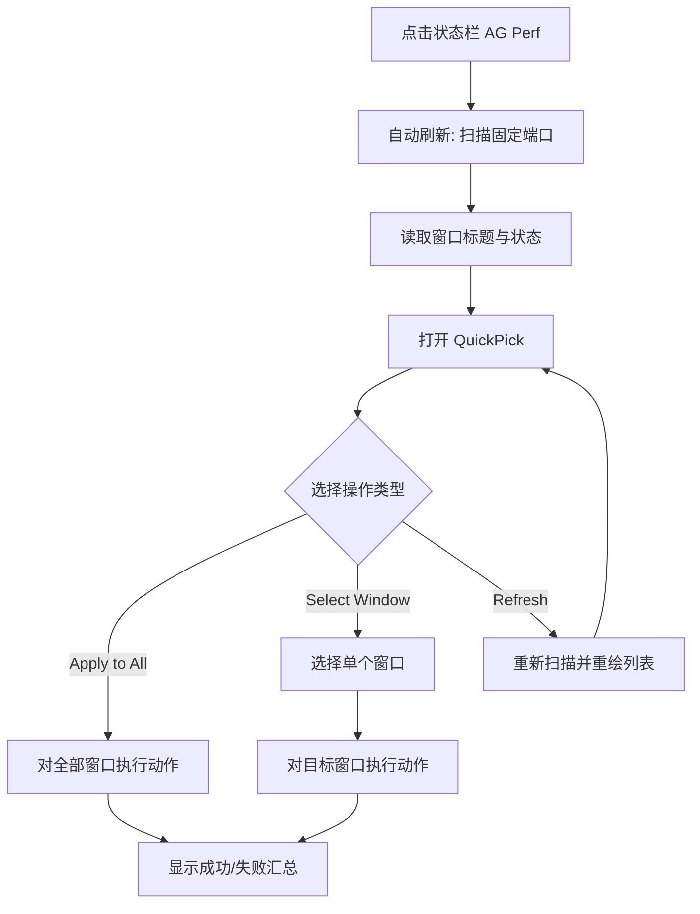

# Product Requirements Document: Antigravity 插件入口 + CDP 控制器

**Version**: 1.0 | **Date**: 2026-03-22 | **Author**: Sarah (Product Owner)

## Executive Summary

本功能为 Antigravity / VS Code 环境提供一个轻量插件入口，用状态栏和命令面板替代手动运行脚本的工作流。  
插件首版运行在 macOS 上，直接连接本机 `127.0.0.1` 的固定 CDP 端口，支持对所有窗口或单个窗口执行 `Full`、`Light`、`Off`、`Close Tabs` 与 `Refresh`。  
核心目标是把高频操作压缩为两次点击内完成，并让用户在多窗口场景下清楚看到每个窗口的真实简化状态。

## Problem Statement

**现状**:
- 当前窗口简化能力主要通过脚本触发，用户需要打开终端、定位脚本并手动执行，操作路径长且不顺手。
- 多开 Antigravity 窗口时，用户无法直观看到哪个窗口已经被 `light` 或 `full` 简化。
- 多个窗口中都可能加载该插件，某个窗口执行了变更后，其他窗口里的插件界面容易显示过期状态。

**方案**:
- 提供插件级状态栏入口与命令面板入口。
- 插件内部直接扫描固定 CDP 端口并连接本机窗口，不依赖 Pilot server。
- 默认支持“作用于所有窗口”，同时支持单窗口精确操作，并在打开菜单时自动刷新真实状态。

**影响**:
- 用户不再依赖终端脚本完成常见操作。
- 多窗口管理效率提升，错误操作概率下降。
- 资源优化能力从“脚本工具”升级为“随手可用的产品能力”。

## Success Metrics

- **操作步数**：`90%` 的常用操作在状态栏入口内 `2 次点击` 完成。  
  **测量方法**：统计从点击状态栏到完成 `Full / Light / Off / Close Tabs / Select Window` 的交互步数。
- **自动刷新时延**：打开菜单后的自动刷新在本机环境中 `90%` 情况下 `2 秒内`完成。  
  **测量方法**：记录从点击状态栏到窗口列表与状态可见的耗时。
- **动作返回时延**：对单窗口或全窗口执行 `Full / Light / Off` 时，`90%` 情况下 `3 秒内`返回结果。  
  **测量方法**：记录从用户确认操作到收到结果摘要通知的耗时。
- **状态可见性**：`100%` 的已发现窗口都必须显示 `off / light / full / unknown` 之一。  
  **测量方法**：以窗口发现数为分母，检查窗口列表中每项是否展示状态。

## User Personas

### Primary Persona: 多窗口重度 Antigravity 用户

- **Goals**:
  - 快速切换窗口简化模式
  - 一眼看出每个窗口当前状态
  - 在不打开终端的前提下完成常用操作
- **Pain Points**:
  - 手动跑脚本麻烦
  - Antigravity 窗口资源占用高时，缺少顺手入口快速瘦身
  - 多窗口下无法确认哪个窗口已经被简化
- **Level**: 高级用户 / 自己维护工作流的开发者

## User Flow

## User Stories & Acceptance Criteria

### Story 1: 全局快捷操作

**As a** 多窗口重度用户  
**I want to** 从状态栏直接对所有 Antigravity 窗口执行常用动作  
**So that** 我不需要打开终端运行脚本

- [ ] 点击状态栏入口后，系统必须先自动刷新，再打开操作菜单。
- [ ] 一级菜单必须包含 `Apply to All: Full`、`Apply to All: Light`、`Apply to All: Off`、`Apply to All: Close Tabs`、`Select Window…`、`Refresh`。
- [ ] 当用户执行任一 “Apply to All” 动作后，系统必须返回汇总结果，至少包含成功窗口数与失败窗口数。
- [ ] 当未发现任何 Antigravity 窗口时，系统仍须打开菜单，并展示 `No Antigravity windows found` 与 `Refresh` 入口。

### Story 2: 单窗口精确控制

**As a** 多窗口用户  
**I want to** 只对某一个目标窗口执行简化或恢复  
**So that** 我可以保留其他窗口的现状

- [ ] 选择 `Select Window…` 后，系统必须展示窗口列表，至少包含 `标题`、`端口`、`状态`。
- [ ] 用户选择某个窗口后，系统必须提供 `Full`、`Light`、`Off`、`Close Tabs`、`Refresh This Window` 五个动作。
- [ ] 对单窗口执行动作时，不得影响未被选中的其他窗口。
- [ ] 若某窗口状态探测失败，系统必须将其显示为 `unknown`，但仍允许用户继续执行动作。

### Story 3: 状态同步与刷新

**As a** 在多个 Antigravity 窗口之间切换的用户  
**I want to** 每次打开菜单都尽量看到最新状态  
**So that** 我不会基于过期信息误操作

- [ ] 每次打开状态栏菜单时，系统必须自动重新扫描固定端口并读取真实状态，而不能只使用本地缓存。
- [ ] 用户手动选择 `Refresh` 后，系统必须重新扫描端口并更新窗口列表与状态。
- [ ] 当另一个窗口中的插件实例或外部脚本修改了某窗口状态后，本窗口插件在下一次打开菜单时必须显示更新后的状态。
- [ ] 首版状态模型必须支持 `off / light / full / unknown` 四种状态显示。

### Story 4: 破坏性操作保护

**As a** 需要偶尔清理大量标签页的用户  
**I want to** 在执行 `Close Tabs` 前得到明确确认  
**So that** 我不会误关重要标签页

- [ ] 用户执行 `Close Tabs` 时，系统必须先展示确认步骤，再发送 CDP 操作。
- [ ] 若用户取消确认，系统不得发起任何 `Close Tabs` 请求。
- [ ] 若部分窗口执行 `Close Tabs` 失败，系统仍须继续处理其他窗口，并在结果中显示部分成功。

### Story 5: 恢复后门

**As a** 使用 `Full` 模式后可能看不到状态栏的用户  
**I want to** 仍然能从命令面板恢复窗口  
**So that** 我不会因为入口被隐藏而无法撤销

- [ ] 插件必须提供命令面板入口，且可在状态栏不可见时使用。
- [ ] 用户必须可以通过命令面板触发 `Off`，恢复窗口。
- [ ] 当状态栏入口不可见时，文档或命令命名必须足够明确，让用户能找到恢复命令。

## Functional Requirements

### FR-1 入口能力

- 插件必须提供一个状态栏入口，作为首要操作入口。
- 插件必须提供命令面板入口，作为恢复路径与替代入口。
- 状态栏文案应体现全局简化概念，例如 `AG Perf`，具体文案可在实现阶段细化。

### FR-2 窗口发现

- 插件必须扫描固定端口：`9000`、`9001`、`9002`、`9003`、`9222`。
- 插件必须只连接 `127.0.0.1` 的 CDP 目标。
- 插件必须从发现结果中过滤可操作的 Antigravity 页面目标。

### FR-3 状态探测

- 插件必须在菜单打开前对已发现窗口执行状态探测。
- 探测结果必须映射为 `off / light / full / unknown`。
- 若 `light` 与 `full` 无法可靠区分，系统必须保留降级路径，但首版目标仍以四态显示为准。

### FR-4 全局动作

- 插件必须支持对全部已发现窗口执行 `Full`、`Light`、`Off`、`Close Tabs`。
- 全局动作执行后，系统必须展示聚合结果。
- 任一窗口失败时，不得阻塞其他窗口继续执行。

### FR-5 单窗口动作

- 插件必须支持对单个窗口执行 `Full`、`Light`、`Off`、`Close Tabs`、`Refresh This Window`。
- 单窗口操作必须显示目标上下文，避免误操作。

### FR-6 刷新与同步

- 打开菜单时必须自动刷新一次。
- 用户必须能手动触发 `Refresh`。
- 系统不得依赖后台持续轮询实现首版同步。

### FR-7 错误反馈

- 当未发现窗口时，系统必须给出明确空状态。
- 当连接失败、探测失败或执行失败时，系统必须反馈原因或至少标记为失败。
- 结果提示必须支持“成功 N / 失败 M”的聚合反馈。

### FR-8 破坏性动作保护

- `Close Tabs` 必须需要确认。
- 首版仅 `Close Tabs` 需要确认，`Full / Light / Off` 不需要额外确认。

### Out of Scope

- 不支持远程主机或非 `127.0.0.1` 连接
- 不支持自定义端口 UI
- 不支持后台自动轮询同步
- 不支持依赖 Pilot server 的模式
- 不提供复杂 Webview 控制面板
- 不承诺首版支持 macOS 以外的平台

## Technical Constraints

### Performance

- 自动刷新目标：`90%` 情况下 `2 秒内`完成。
- `Full / Light / Off` 执行目标：`90%` 情况下 `3 秒内`返回结果。
- 插件首版不得通过高频后台扫描实现同步，以避免额外性能负担。

### Security

- 插件只允许访问 `127.0.0.1` 本地 CDP 端口。
- 插件不得连接远端主机。
- `Close Tabs` 必须经过用户确认。
- 首版不涉及用户凭证、云端同步或远程控制授权。

### Integration

- 插件需要使用 VS Code / Antigravity 扩展 API 提供状态栏、QuickPick、命令面板能力。
- 插件需要通过本地 HTTP 发现 CDP 目标，并通过 WebSocket 执行 CDP 指令。
- 插件需要与现有脚本逻辑保持行为一致，尤其是 `Full / Light / Off / Close Tabs` 的执行语义。

### Platform

- MVP 只支持 macOS。
- MVP 依赖 Antigravity 在固定端口上暴露 CDP。

## MVP Scope & Phasing

### Phase 1: MVP

- 状态栏入口
- 命令面板入口
- 打开菜单自动刷新
- 手动 `Refresh`
- 固定端口扫描
- 全窗口操作
- 单窗口操作
- 四态显示：`off / light / full / unknown`
- `Close Tabs` 确认
- 聚合结果提示

### Phase 2: 增强

- 自定义端口配置
- 更细粒度的状态展示与诊断
- 更丰富的错误细节
- 更强的恢复指引

### Phase 3: 非 MVP 候选

- 远程主机支持
- Webview 控制台
- 自动后台同步
- 与 Pilot server 的可切换模式

## Risk Assessment

| Risk | Prob | Impact | Mitigation |
|------|------|--------|------------|
| Antigravity DOM 结构变化导致 `Close Tabs` 或状态探测失效 | High | High | 将 DOM 相关逻辑集中封装；对失败窗口返回 `unknown` 或失败摘要；保留快速修复点 |
| `Full` 模式隐藏状态栏，用户找不到恢复入口 | Medium | High | 提供命令面板恢复命令，并在文档与命令命名中明确 `Off` 恢复路径 |
| 多窗口下状态过期导致误操作 | High | Medium | 每次打开菜单自动刷新；手动 `Refresh` 兜底；不信任本地缓存 |
| 固定端口未开放或 CDP 不可用 | High | Medium | 空状态与失败反馈清晰化；文档注明启动前置条件 |
| `light` 与 `full` 难以稳定区分 | Medium | Medium | 早期验证探测方法；必要时在实现阶段降级为 `unknown` 并记录风险 |

## Dependencies & Blockers

- Antigravity 必须以固定调试端口之一启动，并在 `127.0.0.1` 暴露 CDP。
- 插件运行环境必须允许访问 `node:http` 与 `node:net` 能力连接本地 CDP。
- 需要已有的 `Full / Light / Off / Close Tabs` 执行逻辑可迁移为插件内部模块。
- 需要尽早验证 `light / full` 状态的可靠识别方式；若无法稳定识别，会影响四态显示承诺。
- 需要在真实 macOS 环境中验证状态栏隐藏后命令面板恢复路径可用。
