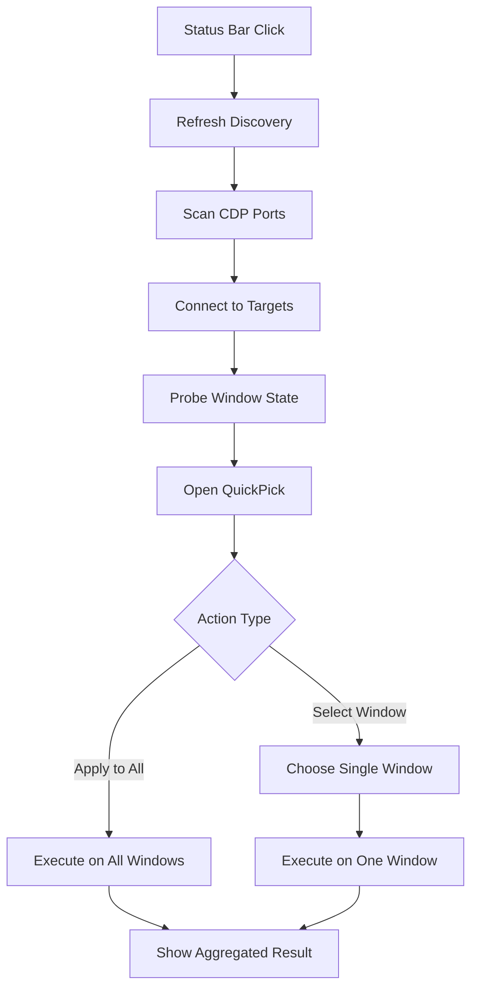

# 头脑风暴：Antigravity 插件入口 + CDP 执行窗口简化

**日期**: 2025-02-14 | **参与者**: 用户 + AI

## 一句话总结

首版采用“**VS Code / Antigravity 插件做入口，插件内直连 CDP 做执行**”的混合架构：状态栏提供统一入口，默认操作所有窗口，也支持单窗口控制；打开菜单时自动刷新一次，并提供手动 `Refresh` 以重扫窗口和同步真实状态。

## 问题空间

- **目的 (Why)**: 用一个更顺手的插件入口来操作 Antigravity 窗口简化能力，减少手动跑脚本的成本，并保留现有基于 CDP 的强控制能力。
- **约束 (Constraints)**:
  - 纯插件 API 无法直接实现现有脚本中的 DOM/CSS 注入能力，必须继续依赖 CDP。
  - 首版不依赖外部 Pilot server，插件自己发现端口并直连 CDP。
  - 可能同时打开多个 Antigravity 窗口，且多个窗口里都装有该插件，UI 状态容易过期。
  - 插件入口需要足够轻量，不能为了“省性能”反而做出更重的控制面板。
- **成功标准**:
  - 点击状态栏即可使用。
  - 默认一键作用于所有发现的窗口。
  - 允许切换到单窗口操作。
  - 打开菜单时自动刷新一次窗口列表和真实状态。
  - 提供显式 `Refresh`，处理多窗口下的状态漂移。

## 维度分析

### 🧑 用户视角

- 用户最想要的是“少一步操作”，而不是重新学习一套复杂后台系统。
- 默认“作用于所有窗口”最符合直觉，适合快速切换 `Full / Light / Off`。
- 当用户只想处理某个窗口时，需要能看到窗口标题并定向操作。
- 多窗口场景下，用户更关心“现在真实是什么状态”，而不是插件上次记住了什么。

### 🔧 技术视角

- 现有能力已经存在于脚本和 Pilot 代码里，核心不是重新发明功能，而是抽出一层可复用的 CDP 执行引擎。
- 状态同步不能依赖插件本地内存，必须每次扫描端口并探测窗口真实状态。
- `Full` / `Light` / `Off` 可以复用现有 CSS 注入与移除逻辑。
- `Close Tabs` 可以复用现有 DOM 点击脚本，但它比 simplify 功能更脆弱，因为更依赖 tab DOM 结构。

### 💰 成本/ROI 视角

- 直接复用现有 CDP 逻辑的 ROI 最高，避免把复杂度推给插件 UI。
- 不引入本地服务，减少安装和运行成本，首版更容易落地。
- 用 `QuickPick` 而不是复杂 Webview，能减少开发量和维护成本。

### ⚠️ 风险视角

- 基于 CDP 的 DOM/CSS 方案仍然受 Antigravity 工作台 DOM 变更影响。
- `Full` 模式如果隐藏状态栏，插件入口本身可能暂时消失，必须保留命令面板恢复路径。
- 多窗口下如果不做实时探测，插件会展示过期状态，导致误操作。
- 端口扫描、连接失败、目标窗口关闭中，都会导致部分窗口执行失败；错误反馈必须是“部分成功”模型。

## 方案对比

### 方案 A：插件直连 CDP + QuickPick 控制器（⭐ 推荐）

- **核心思路**：插件负责状态栏、命令、窗口选择与状态同步；内部直接扫描 CDP 端口并对目标窗口执行 `Full / Light / Off / Close Tabs / Refresh`。
- **优点**：
  - 不依赖外部服务，用户安装插件即可用。
  - 保留现有脚本的核心能力。
  - 交互路径最短，适合状态栏入口。
  - 架构清晰：UI 层与执行层解耦。
- **缺点**：
  - 插件内需要维护一份 CDP 客户端和动作实现。
  - DOM 耦合风险仍然存在。
  - 需要小心处理多窗口下的刷新和错误聚合。
- **适用条件**：希望首版就能独立运行，不要求依赖本地 Pilot 服务。
- **粗略工作量**：2–4 人天。

### 方案 B：插件做入口，调用本地 Pilot HTTP API

- **核心思路**：插件只做 UI；实际执行通过已有的本地 Pilot server API 完成。
- **优点**：
  - 最大化复用现有后端逻辑。
  - 插件代码最薄，后续能力扩展集中在 server。
  - 多窗口状态与窗口发现可以由 server 统一管理。
- **缺点**：
  - 用户必须先运行本地 Pilot 服务。
  - 安装和使用路径更长。
  - 插件体验受 server 状态影响。
- **适用条件**：用户本来就长期运行 Pilot，且接受本地后台常驻。
- **粗略工作量**：1–2 人天。

### 方案 C：插件调现有脚本 / CLI

- **核心思路**：插件点击后直接调用现有 `test-simplify.mjs` 或未来的 CLI。
- **优点**：
  - MVP 极快。
  - 现有脚本改动最少。
- **缺点**：
  - 错误处理、返回结构、跨平台支持都不够好。
  - 长期维护成本高。
  - 不利于做窗口列表、状态探测和自动刷新。
- **适用条件**：只追求一次性快速验证，不打算长期维护。
- **粗略工作量**：0.5–1 人天。

## 方案对比表

| 维度 | 方案 A | 方案 B | 方案 C |
|------|--------|--------|--------|
| 实现复杂度 | 中 | 低 | 低 |
| 用户体验 | 高 | 中 | 低 |
| 可扩展性 | 高 | 高 | 低 |
| 风险 | 中 | 中 | 高 |
| 工作量 | 中 | 低 | 低 |

## 推荐交互设计

### 状态栏入口

- 状态栏显示：`AG Perf: Off` / `AG Perf: Light` / `AG Perf: Full`
- 点击后打开 `QuickPick`
- 打开 `QuickPick` 前先自动执行一次刷新

### QuickPick 一级菜单

- `Apply to All: Full`
- `Apply to All: Light`
- `Apply to All: Off`
- `Apply to All: Close Tabs`
- `Select Window…`
- `Refresh`

### QuickPick 二级菜单：Select Window

- 展示扫描到的窗口列表：`窗口标题 + 端口 + 当前状态`
- 选中窗口后进入操作菜单：
  - `Full`
  - `Light`
  - `Off`
  - `Close Tabs`
  - `Refresh This Window`

## 状态同步设计

- **同步策略**：采用“**打开菜单自动刷新 + 手动 Refresh**”模式。
- **不可信状态**：插件本地缓存只能做瞬时显示，不能当作真实来源。
- **真实状态来源**：
  - 扫描端口发现窗口。
  - 对每个目标窗口通过 CDP 检查是否存在 simplify `style` 标记。
  - `unknown / off / light / full` 分开建模；其中 `light/full` 如果难以可靠区分，首版可先归并为 `simplified`，后续再升级。
- **多窗口一致性**：
  - A 窗口执行修改后，B 窗口插件不会自动推送同步。
  - 但 B 在打开菜单时会自动刷新一次，因此大多数场景下用户看到的是新鲜状态。
  - 手动 `Refresh` 用于窗口刚新增、刚关闭、或用户怀疑状态过期的场景。

## 建议的数据模型

## 首版范围（MVP）

- 状态栏按钮
- 命令面板入口
- 自动刷新 + 手动刷新
- 端口扫描：`9000, 9001, 9002, 9003, 9222`
- 动作：
  - `Full`
  - `Light`
  - `Off`
  - `Close Tabs`
- 批量执行结果提示：成功 N 个、失败 M 个
- 单窗口模式
- 恢复后门：即使 `Full` 隐藏状态栏，也可从命令面板重新触发 `Off`

## 非首版范围

- 自动后台轮询同步
- 复杂 Webview 控制台
- 更细粒度的窗口分组或标签
- 自定义端口配置 UI
- 远程主机支持

## 决策与下一步

**选定方案**: 方案 A  
**理由**: 用户明确选择插件自己直连 CDP，并且首版需要独立运行；同时确认同步策略采用“打开菜单自动刷新 + 手动 Refresh”，这使得方案 A 在体验与复杂度之间最平衡。

### 推荐下一步（Top 3）

1. 写一份 PRD，明确 MVP 命令列表、窗口状态模型、错误反馈和恢复路径。
2. 把 `test-simplify.mjs` 抽成可复用的 TypeScript 模块：`discovery`、`cdp client`、`actions`、`state probe`。
3. 在插件里先做状态栏 + QuickPick 的空壳交互，再接入真实 CDP 执行。

## 未充分探索的方向

- 是否需要区分“当前窗口”和“所有窗口”的快捷键映射。
- 是否要在状态栏上显示“已发现窗口数”。
- `light` 与 `full` 的状态探测是否需要可逆、精确的模式标记，而不只是检测 style 是否存在。
