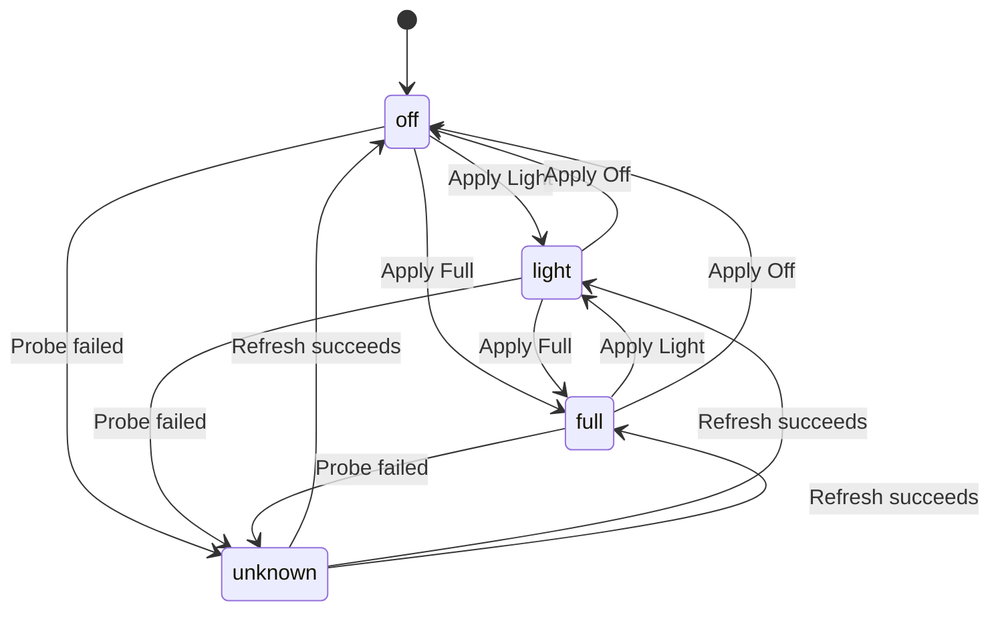

# Test Cases: Antigravity 插件入口 + CDP 控制器

## Overview
- **Feature**: Antigravity 插件入口 + CDP 控制器
- **Requirements Source**: `docs/antigravity-extension-cdp-controller-prd.md`
- **Test Coverage**: 覆盖状态栏入口、命令面板恢复、固定端口发现、全窗口/单窗口动作、刷新同步、空状态、部分失败、`Close Tabs` 确认、状态转换
- **Last Updated**: 2026-03-22

## Test Case Categories

### 1. Functional Tests

#### TC-F-001: 点击状态栏后自动刷新并展示一级菜单
- **Requirement**: FR-1, FR-6
- **Priority**: High
- **Verification Level**: V3（真实环境）
- **Preconditions**:
  - macOS 环境
  - 插件已安装并启用
  - 至少 1 个 Antigravity 窗口已通过固定端口之一暴露 CDP
- **Test Steps**:
  1. 启动 Antigravity 窗口并确认其监听 `9000/9001/9002/9003/9222` 之一。
  2. 在 Antigravity / VS Code 中点击状态栏 `AG Perf` 入口。
  3. 观察菜单打开前是否发生一次自动刷新。
  4. 检查一级菜单内容。
- **Expected Results**:
  - 插件先执行自动刷新，再展示菜单。
  - 一级菜单至少包含 `Apply to All: Full`、`Apply to All: Light`、`Apply to All: Off`、`Apply to All: Close Tabs`、`Select Window…`、`Refresh`。
  - 菜单中可见至少 1 个真实窗口状态。
- **Postconditions**: 无状态变更。

#### TC-F-002: 对所有窗口执行 Full 并返回汇总结果
- **Requirement**: FR-4, FR-7
- **Priority**: High
- **Verification Level**: V3（真实环境）
- **Preconditions**:
  - 至少 2 个 Antigravity 窗口可被发现
  - 两个窗口当前状态均为 `off`
- **Test Steps**:
  1. 点击状态栏入口。
  2. 选择 `Apply to All: Full`。
  3. 等待操作完成提示。
  4. 重新打开菜单查看窗口状态。
- **Expected Results**:
  - 所有可连接窗口都收到 `Full` 动作。
  - 结果提示包含成功窗口数与失败窗口数。
  - 成功窗口状态显示为 `full`。
- **Postconditions**: 所有成功窗口进入 `full`。

#### TC-F-003: 选择单窗口执行 Light 不影响其他窗口
- **Requirement**: FR-5, FR-3
- **Priority**: High
- **Verification Level**: V3（真实环境）
- **Preconditions**:
  - 至少 2 个 Antigravity 窗口可被发现
  - 窗口 A 和窗口 B 初始状态可区分
- **Test Steps**:
  1. 点击状态栏入口。
  2. 选择 `Select Window…`。
  3. 在窗口列表中选择窗口 A。
  4. 执行 `Light`。
  5. 刷新并查看窗口 A 与窗口 B 的状态。
- **Expected Results**:
  - 仅窗口 A 状态变为 `light`。
  - 窗口 B 状态保持原值。
  - 结果提示明确表明目标窗口执行成功。
- **Postconditions**: 仅目标窗口状态发生变化。

#### TC-F-004: 通过命令面板执行 Off 恢复被 Full 隐藏入口的窗口
- **Requirement**: FR-1, Story 5
- **Priority**: High
- **Verification Level**: V3（真实环境）
- **Preconditions**:
  - 至少 1 个窗口已处于 `full`
  - 该窗口的状态栏入口不可见或不方便使用
- **Test Steps**:
  1. 打开命令面板。
  2. 搜索插件提供的恢复命令。
  3. 执行 `Off` 恢复动作。
  4. 检查目标窗口是否恢复。
- **Expected Results**:
  - 命令面板中存在明确可识别的恢复命令。
  - 执行后目标窗口从 `full` 恢复到 `off`。
  - 用户无需依赖状态栏即可完成恢复。
- **Postconditions**: 目标窗口恢复为 `off`。

#### TC-F-005: 手动 Refresh 重扫窗口并更新状态
- **Requirement**: FR-6, FR-3
- **Priority**: High
- **Verification Level**: V3（真实环境）
- **Preconditions**:
  - 至少 1 个窗口可被发现
  - 用户当前菜单中的状态为旧状态，或刚刚发生外部变化
- **Test Steps**:
  1. 点击状态栏入口打开菜单。
  2. 选择 `Refresh`。
  3. 观察窗口列表和状态是否更新。
- **Expected Results**:
  - 插件重新扫描固定端口。
  - 窗口列表与状态标签更新为最新值。
  - 刷新完成时间满足 PRD 目标或记录超时情况。
- **Postconditions**: 本地缓存被最新探测结果覆盖。

#### TC-F-006: 单窗口 Close Tabs 在确认后执行
- **Requirement**: FR-5, FR-8
- **Priority**: High
- **Verification Level**: V3（真实环境）
- **Preconditions**:
  - 至少 1 个窗口含有多个打开的编辑器标签
  - 该窗口可被插件发现
- **Test Steps**:
  1. 点击状态栏入口。
  2. 进入 `Select Window…` 并选择目标窗口。
  3. 点击 `Close Tabs`。
  4. 在确认步骤中选择确认。
  5. 检查目标窗口标签是否被关闭。
- **Expected Results**:
  - 系统先展示确认步骤。
  - 用户确认后才执行 `Close Tabs`。
  - 目标窗口的标签页被关闭，并返回执行结果。
- **Postconditions**: 目标窗口的编辑器标签被关闭。

### 2. Edge Case Tests

#### TC-E-001: 未发现任何窗口时展示空状态与 Refresh
- **Requirement**: FR-7, Story 1
- **Priority**: High
- **Verification Level**: V3（真实环境）
- **Preconditions**:
  - 当前没有任何 Antigravity 窗口监听固定端口
- **Test Steps**:
  1. 点击状态栏入口。
  2. 观察菜单内容。
- **Expected Results**:
  - 菜单正常打开，不直接报错退出。
  - 菜单显示 `No Antigravity windows found`。
  - 菜单中仍保留 `Refresh` 入口。
- **Postconditions**: 无状态变更。

#### TC-E-002: 某窗口状态探测失败时显示 unknown 但仍允许操作
- **Requirement**: FR-3, FR-5
- **Priority**: Medium
- **Verification Level**: V2（受控本地环境）
- **Preconditions**:
  - 至少 1 个窗口可被发现
  - 可通过受控方式让其中 1 个窗口探测脚本失败或返回异常
- **Test Steps**:
  1. 打开状态栏菜单并等待自动刷新。
  2. 找到探测失败的窗口。
  3. 观察其状态显示。
  4. 尝试对该窗口执行 `Off` 或 `Light`。
- **Expected Results**:
  - 探测失败窗口显示为 `unknown`。
  - 该窗口仍可被选择并执行动作。
  - 若后续动作执行成功，状态在下一次刷新时更新为真实值。
- **Postconditions**: 视执行结果而定。

#### TC-E-003: 刷新期间窗口集合变化时列表安全更新
- **Requirement**: FR-6, FR-7
- **Priority**: Medium
- **Verification Level**: V3（真实环境）
- **Preconditions**:
  - 初始有至少 1 个可发现窗口
- **Test Steps**:
  1. 点击状态栏打开菜单。
  2. 在执行 `Refresh` 的同时，启动一个新窗口或关闭一个已有窗口。
  3. 等待刷新完成。
- **Expected Results**:
  - 插件不崩溃、不出现不可恢复错误。
  - 列表反映刷新完成时的最新窗口集合。
  - 已关闭窗口不会继续显示为可操作项；新窗口若已可发现则出现在列表中。
- **Postconditions**: 窗口列表与当前实际集合一致。

### 3. Error Handling Tests

#### TC-ERR-001: Apply to All 时部分窗口失败仍返回部分成功
- **Requirement**: FR-4, FR-7
- **Priority**: High
- **Verification Level**: V2（受控本地环境）
- **Preconditions**:
  - 至少 2 个窗口可被发现
  - 其中 1 个窗口在执行期间会主动断开或返回错误
- **Test Steps**:
  1. 点击状态栏入口。
  2. 选择 `Apply to All: Light`。
  3. 在执行中让其中一个窗口连接失败。
  4. 观察结果提示。
- **Expected Results**:
  - 成功窗口仍完成 `Light`。
  - 失败窗口被计入失败数。
  - 结果提示明确显示“成功 N / 失败 M”。
- **Postconditions**: 成功窗口已更新状态；失败窗口保持原状或标记为未知。

#### TC-ERR-002: 某固定端口连接超时不阻塞其他端口扫描
- **Requirement**: FR-2, FR-7
- **Priority**: Medium
- **Verification Level**: V2（受控本地环境）
- **Preconditions**:
  - 固定端口集合中至少 1 个端口无响应或超时
  - 另一个端口存在正常窗口
- **Test Steps**:
  1. 点击状态栏入口触发自动刷新。
  2. 观察刷新结果。
- **Expected Results**:
  - 超时端口不会导致整体刷新失败。
  - 正常窗口仍被发现并展示。
  - 插件可在合理时间内完成刷新。
- **Postconditions**: 可连接窗口正常列出。

#### TC-ERR-003: 用户取消 Close Tabs 确认时不得发送动作
- **Requirement**: FR-8
- **Priority**: High
- **Verification Level**: V3（真实环境）
- **Preconditions**:
  - 至少 1 个窗口含有多个打开的标签页
- **Test Steps**:
  1. 点击状态栏入口。
  2. 选择单窗口或全窗口 `Close Tabs`。
  3. 在确认步骤中选择取消。
  4. 检查目标窗口标签页状态。
- **Expected Results**:
  - 系统不会发出 `Close Tabs` 执行动作。
  - 目标窗口标签页保持不变。
  - 插件给出“已取消”或等效反馈。
- **Postconditions**: 所有标签页保持原样。

#### TC-ERR-004: 非 localhost 目标被忽略或拒绝
- **Requirement**: FR-2, Technical Constraints / Security
- **Priority**: Medium
- **Verification Level**: V2（受控本地环境）
- **Preconditions**:
  - 存在一个返回远端地址的受控目标或配置污染场景
- **Test Steps**:
  1. 触发窗口发现流程。
  2. 让发现结果中包含非 `127.0.0.1` 目标。
  3. 观察插件是否尝试连接该目标。
- **Expected Results**:
  - 插件忽略或拒绝非 `127.0.0.1` 目标。
  - 不会对远端目标建立连接。
  - 其他合法本地目标不受影响。
- **Postconditions**: 仅本地目标留在可操作集合中。

### 4. State Transition Tests

#### TC-ST-001: 单窗口执行 Off → Light → Full → Off 的状态链路
- **Requirement**: FR-3, FR-5
- **Priority**: High
- **Verification Level**: V3（真实环境）
- **Preconditions**:
  - 至少 1 个窗口初始状态为 `off`
- **Test Steps**:
  1. 对目标窗口执行 `Light`。
  2. 刷新并确认状态为 `light`。
  3. 对同一窗口执行 `Full`。
  4. 刷新并确认状态为 `full`。
  5. 对同一窗口执行 `Off`。
  6. 刷新并确认状态为 `off`。
- **Expected Results**:
  - 每次动作后状态都与执行结果一致。
  - 状态转换顺序可被插件正确识别和展示。
- **Postconditions**: 目标窗口恢复为 `off`。

#### TC-ST-002: 其他窗口实例或外部脚本修改状态后，下一次打开菜单能看到新状态
- **Requirement**: Story 3, FR-6
- **Priority**: High
- **Verification Level**: V3（真实环境）
- **Preconditions**:
  - 至少 1 个窗口可被当前插件实例发现
  - 可通过另一个窗口实例或外部脚本改变该窗口状态
- **Test Steps**:
  1. 在当前插件实例中查看目标窗口当前状态。
  2. 通过另一个窗口实例或外部脚本把该窗口改为不同状态。
  3. 回到当前插件实例，再次点击状态栏入口。
- **Expected Results**:
  - 插件会在菜单打开时重新刷新。
  - 列表显示修改后的真实状态，而不是旧缓存。
- **Postconditions**: 当前实例缓存更新为最新值。

#### TC-ST-003: 全局 Full 后对单窗口 Off，列表显示混合状态
- **Requirement**: FR-4, FR-5, FR-3
- **Priority**: Medium
- **Verification Level**: V3（真实环境）
- **Preconditions**:
  - 至少 2 个窗口可被发现
- **Test Steps**:
  1. 执行 `Apply to All: Full`。
  2. 刷新并确认所有窗口均为 `full`。
  3. 选择其中一个窗口执行 `Off`。
  4. 再次刷新窗口列表。
- **Expected Results**:
  - 被单独恢复的窗口显示为 `off`。
  - 未被恢复的窗口保持 `full`。
  - 列表能正确展示混合状态。
- **Postconditions**: 窗口集合处于混合状态。

## Test Coverage Matrix

| Requirement ID | Test Cases | Coverage Status |
|---------------|------------|-----------------|
| FR-1 入口能力 | TC-F-001, TC-F-004 | ✓ Complete |
| FR-2 窗口发现 | TC-ERR-002, TC-ERR-004 | ✓ Complete |
| FR-3 状态探测 | TC-F-003, TC-F-005, TC-E-002, TC-ST-001, TC-ST-003 | ✓ Complete |
| FR-4 全局动作 | TC-F-002, TC-ERR-001, TC-ST-003 | ✓ Complete |
| FR-5 单窗口动作 | TC-F-003, TC-F-006, TC-E-002, TC-ST-001 | ✓ Complete |
| FR-6 刷新与同步 | TC-F-001, TC-F-005, TC-E-003, TC-ST-002 | ✓ Complete |
| FR-7 错误反馈 | TC-F-002, TC-E-001, TC-E-003, TC-ERR-001, TC-ERR-002 | ✓ Complete |
| FR-8 破坏性动作保护 | TC-F-006, TC-ERR-003 | ✓ Complete |

## Notes
- `Close Tabs`、`light/full` 状态探测与窗口真实变化强依赖 Antigravity 当前 DOM 结构，建议优先在真实环境执行 V3 用例。
- V2 用例适合使用受控本地 mock / 代理环境制造超时、探测失败和非法目标，以稳定覆盖错误路径。
- 若实现阶段无法稳定区分 `light` 与 `full`，需回写 PRD 并同步调整 `TC-F-002`、`TC-F-003`、`TC-ST-001`、`TC-ST-003` 的预期结果。
